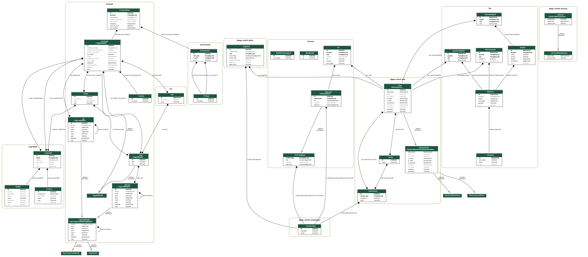

# postcardsaction

A Django based kind of a postcard-picture-blog

## Chat/Contact

There is a matrix chat at #postcards:mtxsrv.org available

## Installation

Quick'n'dirty installation

    $ virtualenv --python=python3 ./
    $ source bin/activate
    $ pip install -r requirements.txt
    $ cd postcardsaction
    $ ./manage.py migrate
    $ ./manage.py collectstatic
    $ ./manage.py createsuperuser
    $ ./manage.py runserver

## Database structure

Created with

    ./manage.py graph_models -a -g -o ../erd.png 

